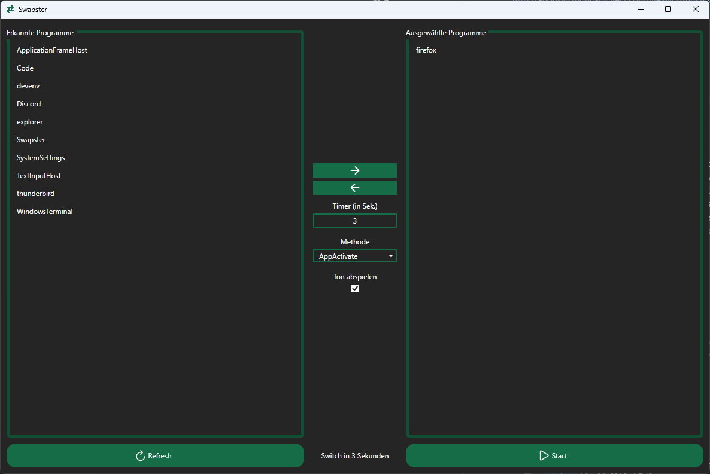
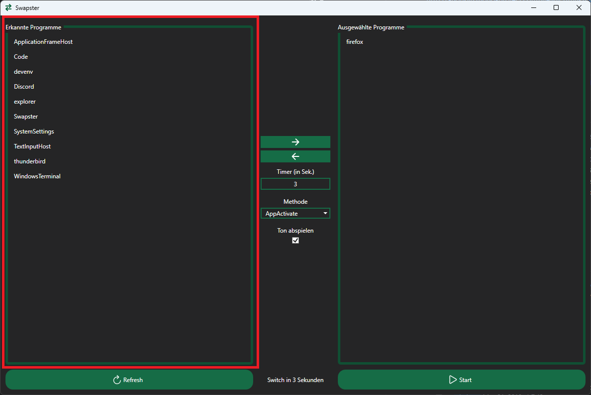
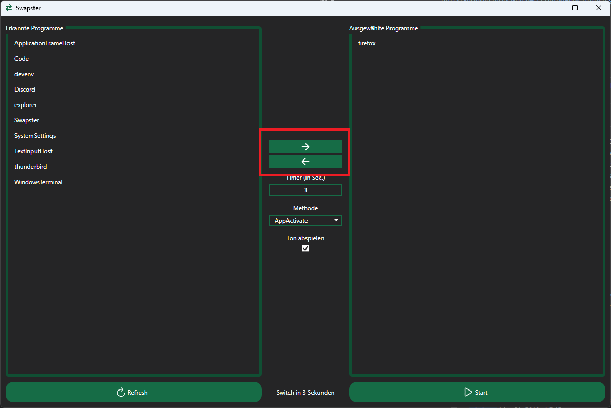

# Swapster
This is a process switcher build originally for Bonjwa to switch between selected processes in a timely manner.
It was build with WPF and .Net 7 and is colored in the Bonjwa Corporate Colors.

The original project from Calax can be found [here](https://github.com/CalaxDev/Switchy/tree/main) (with slightly different approaches behind).

## Running the application
1. Downloaded the latest release file called `Swapster.exe`.
2. Install the .Net Runtime 7 (download here: https://dotnet.microsoft.com/en-us/download/dotnet/7.0)
3. Start the `Swapster.exe` file.

## Recommendation
It is recommended to put all applications in `Window` or `Borderless Fullscreen`!

## Showcase
This is the full application with all features included.

The left hand side shows the currently available but not selected processes that do have a graphical
user interface. Processes can be selected by left-clicking on them. A selection is shown by a 
light blue highlight.

The right hand side shows the currently selected processes. Processes on this list can also be
selected in the same manner.

With the two buttons containing arrows to the left and right you can switch processes from
the left list to the right list and vice versa. You do have to select the process you want to
move first.

Below the arrow buttons is a Timer setting. This represents the time in second between each process
switch. The program will start from the top most process and then switch to the next indefinitly.
When the last process is reached, the program will start again from the top.

The "Methode" selection box allows you to select different methods this program uses to switch between
processes. Due to windows not being 100% reliable, some methods may or may not work best on your system.
While testing this application, the "AppActivate" method (selected by default) worked best for me.

The checkbox below the label "Ton abspielen" will activate sound notifications 3 seconds before the
switch happens. If checked a short "beep" sound will be played at 3, 2 and 1 second before the switch.
When the switch happens, a longer "success" sound will be played.

The Refresh button will refresh both lists of process and will add new processes found to the left list.
Old processes that do not exist anymore will be removed from both lists.
This also stops the current timer if it is running.

The text at the bottom middle of the window shows when the next switch to a process will occure.
It countdowns live from the set Timer to 0.

The "Start" button will start the timer and switch to the first process in the right list.
After this, the button will then display "Stop". Clicking it againg will stop the switching and all timers.

While the timer is running, several errors can occure. Most commonly because a process could not be
found anymore or Swapster couldn't bring it to the front.
If an error occurs, an error message will be displayed giving you a solution hint on how to resolve the issue.
The currently running timer will also be displayed. After clicking "OK" the application is ready to be started again.

